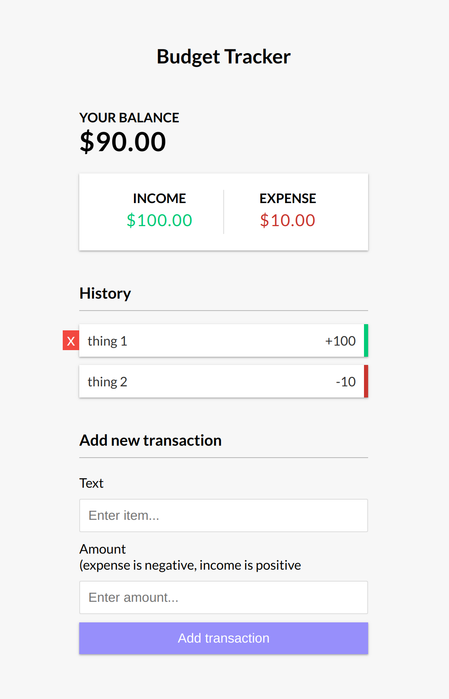

# budget-tracker

Simple budget tracker application using vanilla JavaScript

### Functions:

[The app](https://tn-space.github.io/budget-tracker/)

The app:

- allow user to add new item
- show delete an item on hover
- show income (in green) and expense (in red)
- show total balance

### Images:

